<picture>
  <source media="(max-width: 600px)" srcset="./assets/hero-mobile.svg">
  
</picture>

<picture>
  <source media="(max-width: 600px)" srcset="./assets/terminal-mobile.svg">
  
</picture>

<picture>
  <source media="(max-width: 600px)" srcset="./assets/toolkit-mobile.svg">
  
</picture>

  

<picture>
  <source media="(max-width: 600px)" srcset="./assets/focus-mobile.svg">
  
</picture>

  
  
  
  

<a href="mailto:jowhar.dev@gmail.com">jowhar.dev@gmail.com</a>

About me &amp; toolkit — text version

I'm **Jowhar**, a senior full-stack developer working remotely from **Kerala, India**. I build web applications, backend systems, APIs, and dashboards, with experience across ERP platforms and mobile application backends.

| Area | Tools & technologies |
| :--- | :--- |
| Languages & web | JavaScript, TypeScript, HTML, CSS |
| Frontend | React, Next.js, Redux, Tailwind CSS, Bootstrap |
| Backend & APIs | Node.js, Express, REST APIs, JWT authentication, API integrations |
| Databases & ORMs | MongoDB, PostgreSQL, MariaDB, Redis, Mongoose, Prisma, Drizzle |
| Infrastructure | Docker, NGINX, CI/CD, DNS, SSL, Git |
| Workspace & platforms | Postman, VS Code, Vercel, Heroku, GitHub |

**Currently exploring:** AI-Assisted Engineering · Scalable Frontend Architecture · Distributed Systems Visualization · Modern UI Engineering · Real-time Observability · LLM Integrations & Tooling.

[Portfolio](https://portfolio-jowhar.vercel.app/) · [LinkedIn](https://linkedin.com/in/jowharr) · [Email](mailto:jowhar.dev@gmail.com)

<picture>
  <source media="(max-width: 600px)" srcset="./assets/footer-mobile.svg">
  
</picture>
